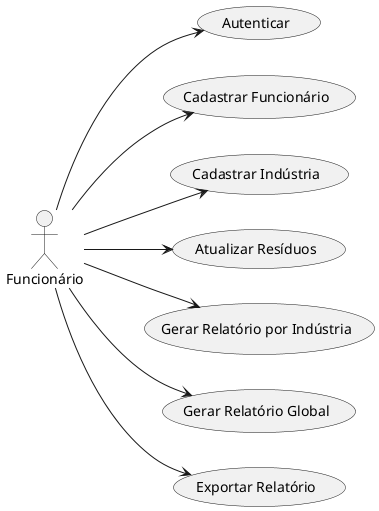
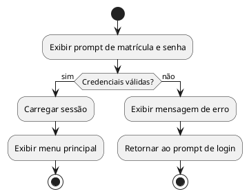
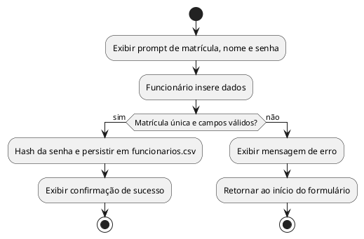
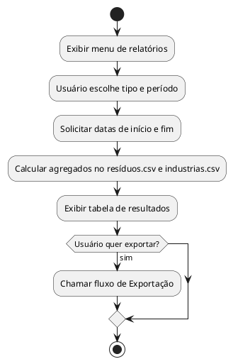
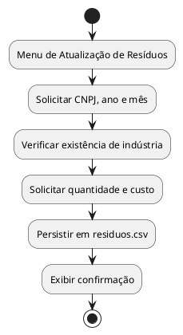
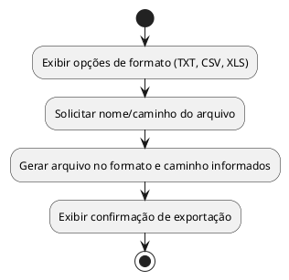

# Software Requirements Specification (SRS) - EcoLógica Soluções Ambientais

**Data:** 27/04/2025  
**Versão:** 0.1

---

## 1. Introdução

### 1.1 Objetivo
Este documento especifica os requisitos funcionais e não?funcionais do sistema EcoLógica Soluções Ambientais, desenvolvido em Linguagem C para gerenciar cadastros, atualizações de resíduos e geração de relatórios.

### 1.2 Escopo
O sistema permitirá a autenticação de funcionários, o cadastro e manutenção de indústrias, o registro mensal de resíduos tratados e a geração de relatórios por indústria e globais com opções de exportação.
O design de telas e fluxos em terminal (console) foi elaborado pelo usuário, conforme docs/ecologica-sistema-fluxo-iu.md.

### 1.3 Definições, Acrônimos e Abreviações
- **CNPJ:** Cadastro Nacional de Pessoa Jurídica
- **CSV:** Comma?Separated Values
- **LGPD:** Lei Geral de Proteção de Dados

### 1.4 Referências
- Documento de requisitos do PIM IV (docs/ecologica-sistema-fluxo-iu.md)
- Manual ABNT (docs/manual.md)

### 1.5 Visão Geral do Documento
Este SRS está organizado em oito seções principais: Visão Geral do Sistema, Requisitos Funcionais, Requisitos Não?Funcionais, Modelos de Dados, Fluxos de Navegação, Critérios de Validação e Testes e Anexos.

## 2. Visão Geral do Sistema

### 2.1 Perspectiva do Produto
Sistema desktop CLI em C, executável no Windows, com interface em terminal (fluxos em console elaborados pelo usuário). A implementação de GUI é considerada extensão opcional e não faz parte da versão base.

### 2.2 Funcionalidades Principais
- Autenticação de usuário
- CRUD de funcionários e indústrias
- Registro mensal de resíduos
- Geração de relatórios (indústria e globais)
- Exportação em TXT, CSV e XLS

### 2.3 Funcionários
- **Funcionário:** acessa o sistema após autenticação e realiza todas as operações conforme fluxos disponíveis

### 2.4 Restrições
- Funcionamento apenas em ambiente Windows
- Persistência exclusivamente em arquivos CSV
- Interface gráfica (GUI) não está contemplada na versão base; apenas CLI em terminal.

### 2.5 Premissas e Dependências
- Arquivos de dados existentes (funcionarios.csv, industrias.csv, residuos.csv)
- Biblioteca de criptografia simples disponível

## 3. Requisitos Funcionais

| ID    | Descrição                                          |
|-------|----------------------------------------------------|
| RF-01 | Autenticação (login/logout com matrícula e senha)  |
| RF-02 | Gestão de Funcionários (CRUD)                      |
| RF-03 | Gestão de Indústrias (CRUD com validação de CNPJ) |
| RF-04 | Atualização Mensal de Resíduos                     |
| RF-05 | Relatórios por Indústria (insumos e gastos)        |
| RF-06 | Relatórios Globais (regiões, menores volumes, aporte) |
| RF-07 | Exportação de relatórios em TXT, CSV e XLS         |

### 3.1 RF-01: Autenticação
#### 3.1.1 Pré-condição
- Arquivo funcionarios.csv existe e contém pelo menos um registro válido (funcionário cadastrado).
#### 3.1.2 Fluxo Principal
1. Usuário inicia o programa e vê prompt de login.
2. Usuário informa matrícula e senha.
3. Sistema valida credenciais (senha comparada via hash).
4. Se válidas, carrega sessão e exibe menu principal.
#### 3.1.3 Fluxos Alternativos
- 3A: Matrícula não encontrada ? exibe mensagem de erro e retorna ao prompt.
- 3B: Senha incorreta ? exibe mensagem de erro e retorna ao prompt.
#### 3.1.4 Pós-condição
- Sessão ativa com funcionário autenticado ou retorno ao prompt em caso de falha.
#### 3.1.5 Exemplo de I/O
Entrada: "matricula=1234, senha=senha123"
Saída: "Login realizado com sucesso!" ou "Erro! Usuário ou Senha Inválidos"

### 3.2 RF-02: Gestão de Funcionários
#### 3.2.1 Pré-condição
- Funcionário autenticado.
#### 3.2.2 Fluxo Principal
1. No menu, Administrador escolhe opção "Cadastro de Funcionário".
2. Sistema solicita matrícula, nome e senha do novo funcionário.
3. Usuário fornece dados; sistema aplica hash na senha.
4. Sistema adiciona registro ao funcionarios.csv.
5. Sistema confirma cadastro bem-sucedido.
#### 3.2.3 Fluxos Alternativos
- 2A: Matrícula já existente ? exibe erro e solicita nova matrícula.
- 3A: Dados inválidos (campo vazio) ? exibe mensagem e repete entrada.
#### 3.2.4 Pós-condição
- Novo registro de funcionário persistido ou operação abortada.
#### 3.2.5 Exemplo de I/O
Entrada: matrícula=2001, nome="Ana Silva", senha="abc123"
Saída: "Cadastro realizado com sucesso!"

### 3.3 RF-03: Gestão de Indústrias
#### 3.3.1 Pré-condição
- Funcionário autenticado.
#### 3.3.2 Fluxo Principal
1. No menu, Administrador escolhe opção "Cadastro de Indústria".
2. Sistema solicita campos: CNPJ, razão social, nome fantasia, telefone, endereço, e-mail, data de abertura.
3. Usuário preenche; sistema valida formato de CNPJ e data.
4. Se válidos, adiciona registro ao industrias.csv.
5. Sistema confirma cadastro bem-sucedido.
#### 3.3.3 Fluxos Alternativos
- 2A: Formato de CNPJ inválido ? exibe erro e solicita reentrada.
- 3A: Data de abertura fora do formato dd/mm/aaaa ? exibe mensagem e repete entrada.
#### 3.3.4 Pós-condição
- Novo registro de indústria persistido ou operação abortada.
#### 3.3.5 Exemplo de I/O
Entrada: CNPJ="12.345.678/0001-90", razãoSocial="X Indústria Ltda", ...
Saída: "Cadastro realizado com sucesso!"

### 3.4 RF-04: Atualização Mensal de Resíduos
#### 3.4.1 Pré-condição
- Funcionário autenticado.
#### 3.4.2 Fluxo Principal
1. No menu principal, usuário escolhe "Atualização Mensal de Resíduos".
2. Sistema solicita CNPJ da indústria, ano e mês.
3. Usuário informa valores; sistema verifica existência da indústria.
4. Sistema solicita quantidade de resíduos tratados e custo estimado.
5. Usuário fornece dados; sistema grava ou atualiza registro em residuos.csv.
6. Sistema confirma registro bem-sucedido.
#### 3.4.3 Fluxos Alternativos
- 2A: Indústria não cadastrada ? exibe erro e retorna ao menu.
- 3A: Formato de data inválido (mês fora de 1–12 ou ano fora de faixa) ? exibe mensagem e repete entrada.
- 4A: Quantidade ou custo inválidos (não numéricos ou negativos) ? exibe erro e repete entrada.
#### 3.4.4 Pós-condição
- Registro atualizado ou inserido no arquivo residues.csv, ou operação abortada.
#### 3.4.5 Exemplo de I/O
Entrada: CNPJ=12.345.678/0001-90, ano=2025, mês=4, quantidade=1500.5, custo=7500.00
Saída: "Atualização registrada com sucesso!"

### 3.5 RF-05: Relatórios por Indústria
#### 3.5.1 Pré-condição
- Funcionário autenticado.
- Arquivos industrias.csv e residuos.csv presentes.
#### 3.5.2 Fluxo Principal
1. Menu principal ? "Relatórios por Indústria" ? solicita CNPJ.
2. Usuário informa CNPJ; sistema valida existência.
3. Exibe submenu: Insumos Tratados por Período ou Total de Gastos por Período.
4. Usuário escolhe opção e período (mensal, semestral, anual).
5. Sistema solicita data inicial e final.
6. Sistema calcula valores agregados (soma de resíduos ou custos) e exibe tabela.
7. Oferece opções de exportação ou voltar ao menu.
#### 3.5.3 Fluxos Alternativos
- 1A,2A: CNPJ não encontrado ? erro e retorno ao menu anterior.
- 4A: Período inválido ? mensagem e retorno ao submenu.
- 5A: Datas fora de formato ou ordem incorreta ? erro e nova solicitação.
#### 3.5.4 Pós-condição
- Relatório exibido em tela ou exportado com sucesso.
#### 3.5.5 Exemplo de I/O
Entrada: CNPJ=12.345.678/0001-90, opção=1, período=Mensal, data inicial=01/2025, data final=04/2025
Saída: Tabela de insumos tratados por mês entre Jan/2025 e Abr/2025

### 3.6 RF-06: Relatórios Globais
#### 3.6.1 Pré-condição
- Funcionário autenticado.
- Arquivos industrias.csv e residuos.csv presentes.
#### 3.6.2 Fluxo Principal
1. Menu principal ? "Relatórios Globais".
2. Sistema exibe opções: (1) Regiões com Maior Volume, (2) Indústrias com Menores Volumes, (3) Aporte Financeiro por Período.
3. Usuário escolhe opção e período (mensal, semestral, anual).
4. Sistema solicita data inicial e final.
5. Conforme opção, calcula e ordena resultados:
   - Regiões: agrupa indústrias por estado e soma volumes.
   - Menores volumes: lista indústrias com menores totais.
   - Aporte: soma custos por indústria ou região.
6. Exibe relatório em formato tabela e oferece exportação.
#### 3.6.3 Fluxos Alternativos
- 2A: Opção inválida ? mensagem e repetição do menu.
- 4A: Datas inválidas ? erro e nova solicitação.
#### 3.6.4 Pós-condição
- Relatório global exibido ou exportado.
#### 3.6.5 Exemplo de I/O
Entrada: opção=1, período=Semestral, data inicial=01/2025, data final=06/2025
Saída: Lista de estados ordenados por volume tratado, de maior para menor

### 3.7 RF-07: Exportação de Relatórios
#### 3.7.1 Pré-condição
- Relatório gerado conforme RF-05 ou RF-06 e em exibição na tela, funcionário logado.
- Permissões de escrita no diretório de exportação.
#### 3.7.2 Fluxo Principal
1. Após exibir o relatório, sistema oferece opções de exportação: (1) TXT, (2) CSV, (3) XLS, (0) Voltar.
2. Usuário escolhe formato.
3. Sistema solicita nome ou caminho de arquivo para salvar.
4. Usuário informa nome; sistema gera arquivo no formato escolhido com a tabela de dados.
5. Sistema confirma sucesso e exibe caminho do arquivo.
#### 3.7.3 Fluxos Alternativos
- 2A: Opção inválida ? exibe mensagem e repete menu de exportação.
- 3A: Caminho ou nome inválido (caracteres proibidos) ? exibe erro e solicita novamente.
- 4A: Falha de I/O (permissão, espaço insuficiente) ? exibe erro e retorna ao menu de exportação.
#### 3.7.4 Pós-condição
- Arquivo de relatório salvo no formato e local informados, ou operação abortada.
#### 3.7.5 Exemplo de I/O
Entrada: formato=CSV, arquivo="relatorio_industria_04_2025.csv"
Saída: "Relatório exportado com sucesso para relatorio_industria_04_2025.csv"

## 4. Requisitos Não?Funcionais

- **RNF-01:** Persistência em arquivos CSV
- **RNF-02:** Criptografia simples de senhas (LGPD)
- **RNF-03:** Tempo de geração de relatório ? 2s
- **RNF-04:** Interface CLI clara e consistente
- **RNF-05:** Arquitetura modular em C com headers e fontes organizados

## 5. Modelos de Dados

```c
// Funcionário
typedef struct {
    int matricula;
    char nome[100];
    char hashSenha[64];
} Funcionario;

// Indústria
typedef struct {
    char cnpj[15];
    char razaoSocial[100];
    char nomeFantasia[100];
    char telefone[20];
    char endereco[150];
    char email[100];
    char dataAbertura[11]; // dd/mm/aaaa
} Industria;

// Resíduo
typedef struct {
    char cnpj[15];
    int mes;
    int ano;
    double quantidade;
    double custo;
} Residuo;
```

## 6. Fluxos de Navegação

- Tela de Login ? Menu Principal
- Menu Principal ? [Cadastro Funcionário | Cadastro Indústria | Atualização Resíduos | Relatórios]
- Rotas de exportação e retorno ao menu

## 7. Critérios de Validação e Testes

- Testes unitários para funções de CRUD e criptografia
- Testes de integração do fluxo completo (login ? cadastro ? relatório)
- Planilha de casos de teste com entradas válidas e inválidas

## 8. Anexos

- Diagramas de Caso de Uso



- Diagramas de Atividade











- Glossário
  - CSV: formato com valores separados por vírgula.
  - CNPJ: Cadastro Nacional de Pessoa Jurídica.
  - LGPD: Lei Geral de Proteção de Dados.
  - Hash: representação codificada de senha.
  - CLI: interface de linha de comando.
